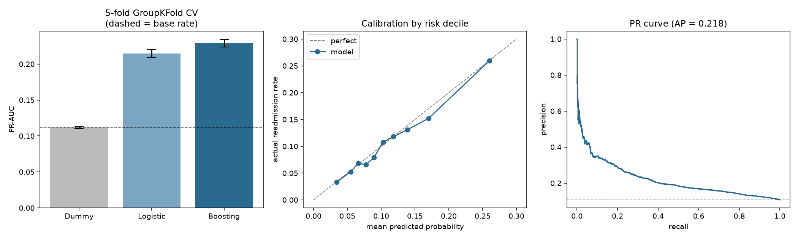

# Hospital Readmission Prediction

[](https://github.com/Yasminenaser1/tabular-lab/actions/workflows/ci.yml)

**Live demo:** https://readmission-risk.onrender.com — Render free tier, kept warm by a scheduled GitHub Actions ping.


Predicting 30-day readmission for diabetic patients using the UCI Diabetes
130-US Hospitals dataset — 101,766 encounters across 71,518 unique patients (99,343 after exclusions, below),
de-identified real clinical records from 130 US hospitals (1999–2008),
CC BY 4.0.



## Headline

The model separates risk well: patients in the **top predicted-risk decile
readmit at 27.8%, versus 4.0% in the bottom decile — a 6.9x lift.**
Predicted probabilities are well calibrated (see centre panel), so the scores
can be read as actual risk, not just a ranking.

## Why this problem is harder than it looks

**Class imbalance.** Only 11.4% of encounters are 30-day readmissions.
Accuracy is meaningless here — predicting "no" for everyone scores 88.6%.
All results are reported as PR-AUC.

**Patient leakage.** Patients appear multiple times (~30,000 repeat
encounters). A random row split places the same patient in both train and
test, silently inflating every score. All splits are grouped by `patient_nbr`
and asserted non-overlapping.

**Informative missingness.** `A1Cresult` and `max_glu_serum` are 85–95%
missing, but a test *not* being ordered is itself a signal. These are encoded
as their own category rather than dropped. `weight` (97% missing) is dropped.

**Structural negatives.** 2,423 encounters (2.4%) end in death (discharge
codes 11, 19, 20, 21) or hospice transfer (13, 14). These patients cannot be
readmitted — their readmission rate is 1.8% vs 11.4% for everyone else. They
are excluded, because a model that learns "discharge code 11 means no
readmission" is correct and clinically useless.

**High-cardinality diagnoses.** `diag_1/2/3` hold ~700 distinct ICD-9 codes
each. These are grouped into nine clinical categories (circulatory,
respiratory, diabetes, etc.) rather than one-hot encoded raw.

## Results

5-fold `GroupKFold` cross-validation, PR-AUC:

| Model | PR-AUC | vs. base rate |
|-------|--------|---------------|
| Dummy (predicts base rate) | 0.1139 ± 0.0019 | — |
| Logistic regression | 0.2153 ± 0.0048 | +89% |
| Gradient boosting | 0.2306 ± 0.0040 | +102% |

Boosting beats logistic regression in **5 of 5 folds** (mean gain 0.0154,
worst fold +0.0087), so the improvement survives resampling rather than
being an artifact of one split.

ROC-AUC for the boosting model on the held-out test set is 0.669 — much higher than PR-AUC because
the large negative class flatters the false-positive rate. PR-AUC is the
honest metric at this base rate.

## What drives the model

Permutation importance (drop in PR-AUC when a feature is shuffled):

| Feature | Drop |
|---------|------|
| `number_inpatient` | 0.0795 |
| `discharge_disposition_id` | 0.0567 |
| `number_emergency` | 0.0099 |
| `diag_3_group` | 0.0058 |

Prior hospitalizations dominate — past admissions are the strongest predictor
of future ones. Discharge destination is second, which is clinically
sensible: where a patient goes after release shapes whether they come back.

## Where the model fails

Subgroup PR-AUC on the held-out test set:

- **Patients aged 90–100 (n=547): PR-AUC 0.194, ROC-AUC 0.540** — close to
  chance, against ~0.65 ROC-AUC for other age bands. This does not appear to be a
  base-rate artifact: that group has the *highest* base rate of any age band (12.8%).
  The model is weakest at ranking the patients most likely to be readmitted.
  Plausibly the features here don't capture what drives readmission in the
  very elderly — frailty, social support, care setting.
- **African American patients (n=3,707): PR-AUC 0.190 vs 0.238 for Caucasian
  patients (n=14,886)** at similar base rates (10.7% vs 11.5%). Both samples
  are large enough for this gap to be a stable estimate.
- **Patients with race unrecorded (n=418): PR-AUC 0.168** — the weakest
  group overall, though see the caveat below.

Subgroups below roughly 500 encounters (~40 positives) produce unstable
PR-AUC estimates. That includes the unrecorded-race group above and puts the
90–100 band close to the line, so both should be read as indicative rather
than settled. Small subgroups that score *well* (e.g. ages 20–30, PR-AUC
0.537 on n=388) are not reported as strengths for the same reason.

**This model should not be deployed for the 90+ population, and the
performance gap across race groups would need to be addressed before any
clinical use.** Reporting subgroup performance matters on real patient data
where race, gender, and age are present.

## API

A FastAPI service wraps the trained pipeline:

- `GET /schema` — field names and valid values, so a client can build its form from the model
- `GET /metadata` — model version and CV performance
- `POST /predict` — returns a probability, the baseline rate, lift, and a risk band

**Known limitations are returned with every prediction.** If a request falls
into a subgroup where the model underperforms, the response includes a caveat:

```json
{
  "probability": 0.349,
  "lift_vs_baseline": 3.06,
  "band": "high",
  "caveats": ["Ages 90-100: model performs near chance for this group (ROC-AUC 0.540). Not suitable for use here."]
}
```

A consumer is warned at the point of use rather than being expected to have
read the documentation.

The web UI at `/` is a three-step flow generated from `/schema` — fields,
valid values and defaults come from the model, not a hand-written form — and
renders those caveats in red above the score. Three example patients let a
visitor see the model react without filling in 22 fields. Light, dark and
system themes.

Run it with:

```bash
uvicorn api:app --reload --port 8000
```

Built with scikit-learn 1.9.0; the pickled pipeline may not load under a
different version.

## Tests & deployment

`tests/test_api.py` exercises the service without the dataset: schema/model
agreement, the 422 on missing features, the subgroup caveats, and a behavioral
check that more prior inpatient stays raise predicted risk — a retrained model
that got that backwards would fail CI. `tests/test_split.py` needs the data
and skips when it is absent. GitHub Actions runs the suite on every push.

The `Dockerfile` builds a slim image from `requirements-api.txt` (no plotting
or download dependencies) and reads the port from `PORT`; Render deploys it
from `main` automatically.

```bash
pip install -r requirements-dev.txt
pytest -q
```

## Reproducing

```bash
python3 -m venv venv && source venv/bin/activate
pip install -r requirements.txt
# download dataset id 296 from UCI into data/

python explore.py          # split integrity + data audit
python baseline.py         # dummy vs. logistic on numeric features
python features.py         # + categorical encoding and ICD-9 grouping
python boost.py            # gradient boosting
python cv.py               # 5-fold GroupKFold
python error_analysis.py   # calibration, subgroups, permutation importance
python plots.py            # figures/results.png
python save_model.py       # fit on all data -> models/pipeline.joblib
python build_schema.py     # field metadata -> models/schema.json
```

## Data

Clore, J., Cios, K., DeShazo, J., & Strack, B. (2014). *Diabetes 130-US
Hospitals for Years 1999-2008*. UCI Machine Learning Repository.
https://doi.org/10.24432/C5230J

